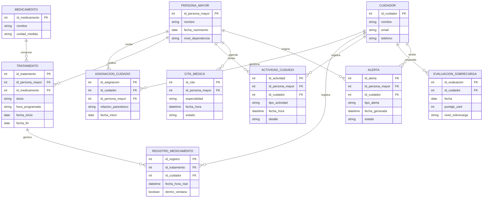

```mermaid
erDiagram
  CUIDADOR ||--o{ ASIGNACION_CUIDADO : gestiona
  PERSONA_MAYOR ||--o{ ASIGNACION_CUIDADO : recibe
  PERSONA_MAYOR ||--o{ TRATAMIENTO : indica
  MEDICAMENTO ||--o{ TRATAMIENTO : compone
  TRATAMIENTO ||--o{ REGISTRO_MEDICAMENTO : genera
  CUIDADOR ||--o{ REGISTRO_MEDICAMENTO : registra
  PERSONA_MAYOR ||--o{ ACTIVIDAD_CUIDADO : recibe
  CUIDADOR ||--o{ ACTIVIDAD_CUIDADO : registra
  PERSONA_MAYOR ||--o{ CITA_MEDICA : agenda
  CUIDADOR ||--o{ EVALUACION_SOBRECARGA : responde
  PERSONA_MAYOR ||--o{ ALERTA : origina
  CUIDADOR ||--o{ ALERTA : recibe

  CUIDADOR {
    int id_cuidador PK
    string nombre
    string email
    string telefono
  }
  PERSONA_MAYOR {
    int id_persona_mayor PK
    string nombre
    date fecha_nacimiento
    string nivel_dependencia
  }
  ASIGNACION_CUIDADO {
    int id_asignacion PK
    int id_cuidador FK
    int id_persona_mayor FK
    string relacion_parentesco
    date fecha_inicio
  }
  MEDICAMENTO {
    int id_medicamento PK
    string nombre
    string unidad_medida
  }
  TRATAMIENTO {
    int id_tratamiento PK
    int id_persona_mayor FK
    int id_medicamento FK
    string dosis
    string hora_programada
    date fecha_inicio
    date fecha_fin
  }
  REGISTRO_MEDICAMENTO {
    int id_registro PK
    int id_tratamiento FK
    int id_cuidador FK
    datetime fecha_hora_real
    boolean dentro_ventana
  }
  ACTIVIDAD_CUIDADO {
    int id_actividad PK
    int id_persona_mayor FK
    int id_cuidador FK
    string tipo_actividad
    datetime fecha_hora
    string detalle
  }
  CITA_MEDICA {
    int id_cita PK
    int id_persona_mayor FK
    string especialidad
    datetime fecha_hora
    string estado
  }
  EVALUACION_SOBRECARGA {
    int id_evaluacion PK
    int id_cuidador FK
    date fecha
    int puntaje_zarit
    string nivel_sobrecarga
  }
  ALERTA {
    int id_alerta PK
    int id_persona_mayor FK
    int id_cuidador FK
    string tipo_alerta
    datetime fecha_generada
    string estado
  }
```
